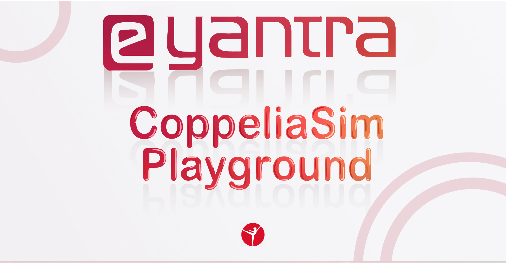
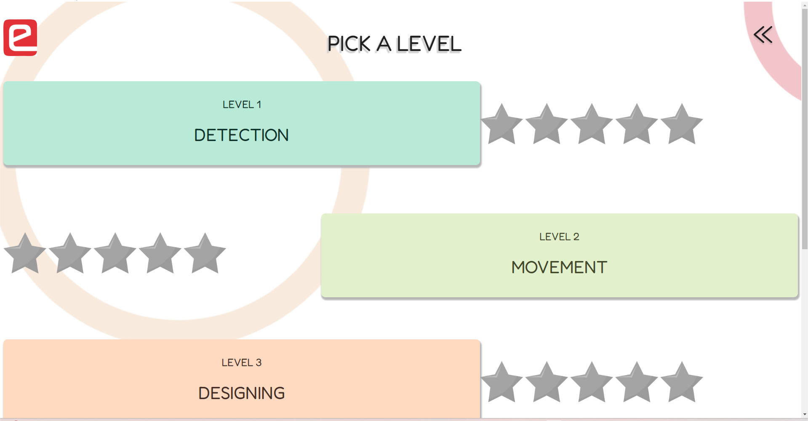
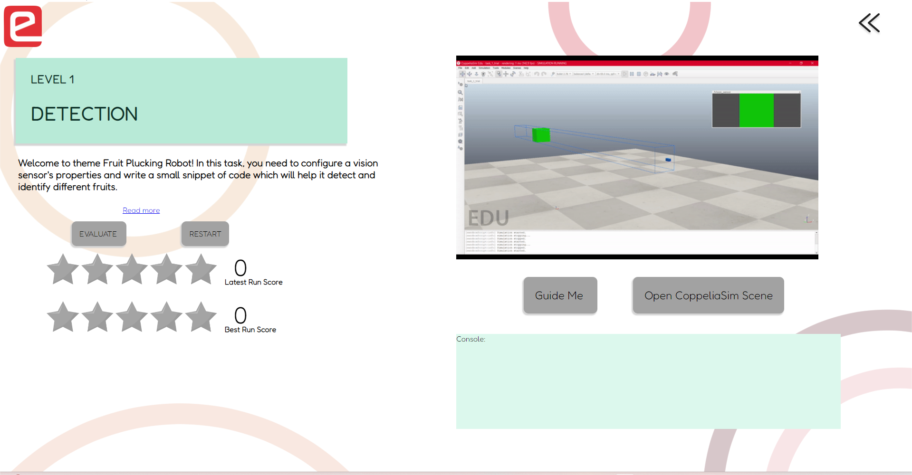
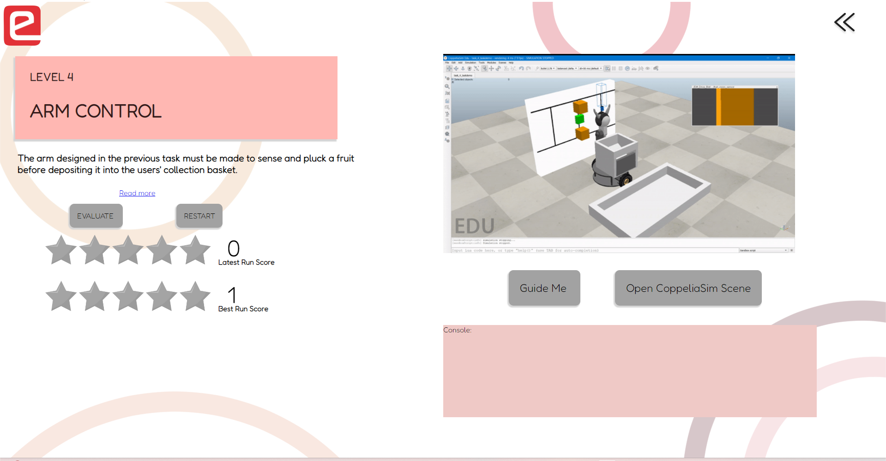

<h1>CoppeliaSim Playground</h1>
  

### Overview
CoppeliaSim playground is a desktop application that was created to re-use some of the older e-Yantra Robotics competition themes (eYRC) and deploy them in a self-learning based application by leveraging an **interactive GUI** and providing relevant **resources and hints** wherever required.

### App Features
- Currently featured EYRC Themes- **Fruit Plucking Robot**.
- App works in both online mode and offline mode.
- Task Output saved to Google Sheets.
- Clickstream Data saved to Google Sheets.

### Technical Stack
Python, ElectronJS, Lua, CoppeliaSim Simulator

## App Screenshots

 <b>Figure 1: CoppeliaSim Playground Welcome Screen</b>

 
 <b>Figure 2: Theme Selection</b>

 <b>Figure 3: Level Selection</b>

 
 <b>Figure 4: Levels in a theme</b>

